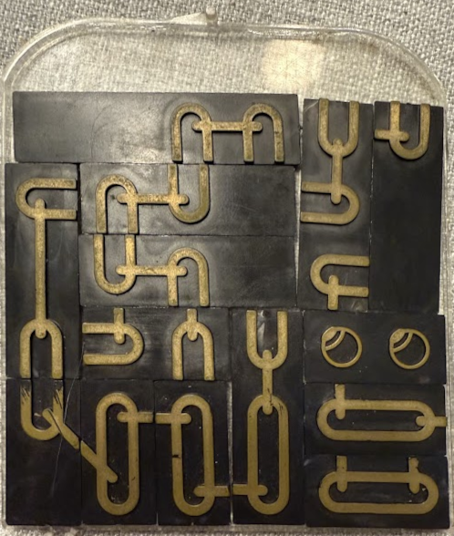

# A wave function collapse / recursive backtracking solver for a puzzle my dad has

## Here is the actual puzzle:

## Credits
[https://github.com/azmr/blit-fonts](https://github.com/azmr/blit-fonts) for the simple font [image](resources/blit32.png)